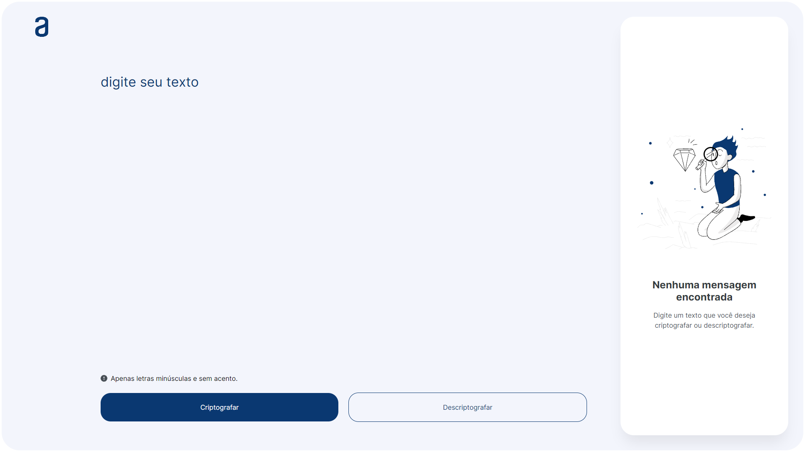
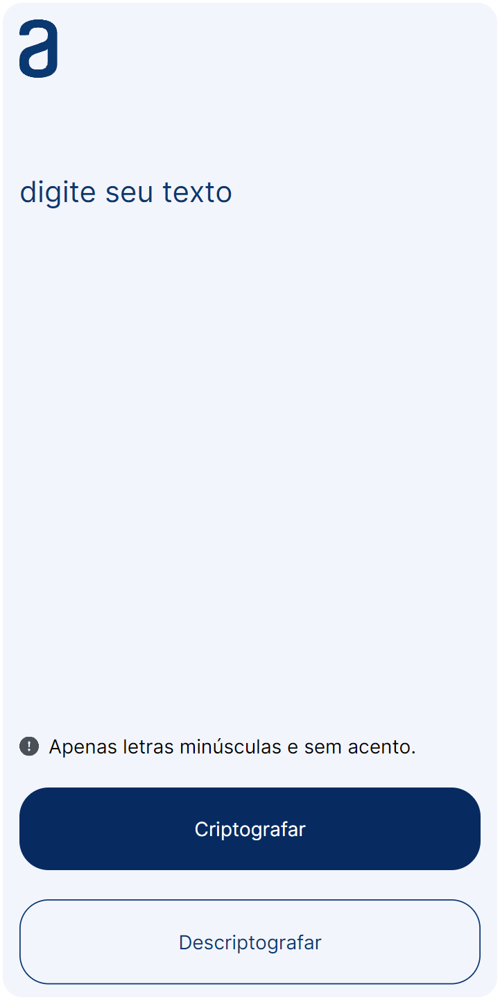

 

<h1 align="center">Projeto: Decodificador Alura</h1>

 

> Projeto Alura Challenge. Da formação One Oracle Next Education

 

## Imagens do Projeto:

#### 01. Desktop:

 

<small>Imagem da versão Desktop do site.</small>

#### 02. Mobile:

 

<small>Imagem da versão mobile do site.</small>

 

## Links e Referências:

- **Link do Site:** [Alura Decodificador](https://larahav-dev.github.io/Projeto-Alura-Decodificador/) 
- **Link do Projeto:** [Repositório Alura Decodificador](https://github.com/larahav-dev/Projeto-Alura-Decodificador/) 